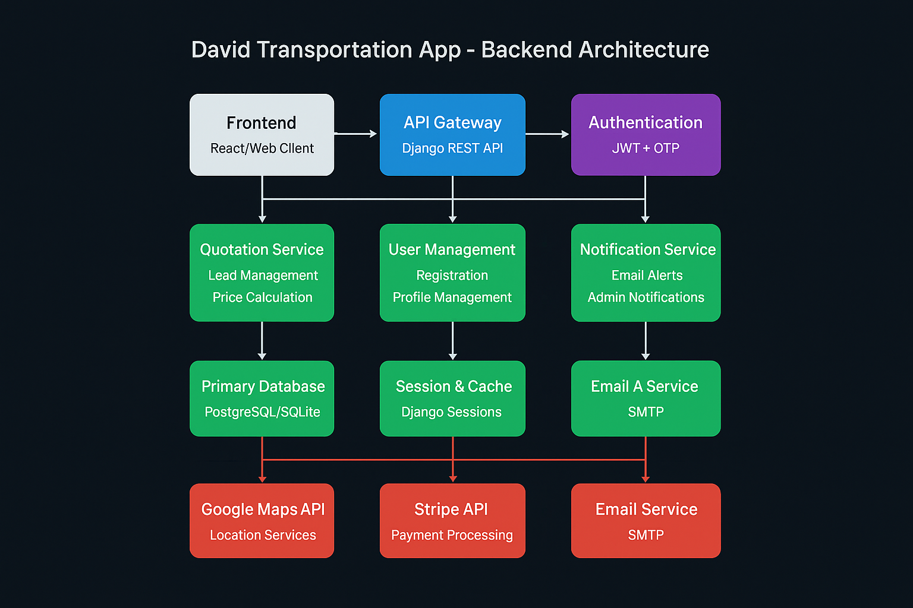

# David Transportation App - Setup Guide


## Architecture Overview


## 1. Clone the Repository
```bash
git clone -b dev-manan --single-branch https://github.com/Cplus-Soft-Limited/david_transportation_app.git
```

## 2. Backend Setup (Django)

### Navigate to backend directory:
```bash
cd david_transportation_app_backend
```

### Create virtual environment:
```bash
python -m venv venv
```

### Activate virtual environment:
```bash
# For Windows:
venv\Scripts\activate

# For macOS/Linux:
source venv/bin/activate
```

### Install requirements:
```bash
pip install -r requirements.txt
```

### Setup database:
```bash
python manage.py makemigrations
python manage.py migrate
```

### Create superuser:
```bash
python manage.py createsuperuser
```
Follow prompts to create username and password.

### Run Django server:
```bash
python manage.py runserver
```
Server will start at [http://127.0.0.1:8000](http://127.0.0.1:8000).

Django Admin panel: [http://127.0.0.1:8000/admin](http://127.0.0.1:8000/admin)

### Admin Profile Creation For Admin Dashboard
```bash
Step 1: Login to the already created superuser, from django admin from this url (http://127.0.0.1:8000/admin)
Step 2: Go to Admin Profiles, create one and check the 'isapproved' checkbox.
Step 3: Go to Users -> select the same user which got approved.
Step 4: check the isStaff checbox in that user's setting and save.
Step 5: Now login to admin dashboard below.
```


### Admin Dashboard
```bash
http://localhost:3000/admin_dashboard
```

### Make sure to check the port of the server on which is running from terminal
------------------------------------------------
End of Setup Guide
